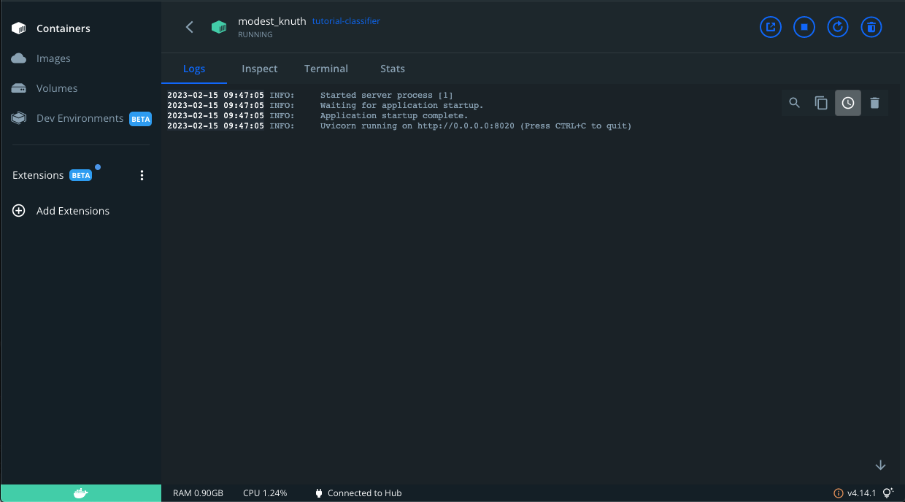

# Introduction 
**This repository is created by Marc Blomvliet (Aurai), which is solely intended for educational purposes.**  
  
In this tutorial you will learn how to create an Docker image of your fastAPI application.  
The following is included in this application:  
* Accepts two questions as input 
* Returns a prediction whether the two questions are similar or not similar 
* Saves the raw user input data in your MongoDB database  
* Predictions are saved in your MongoDB database   

*The application makes use of my own pre-trained model (with the use of MLFlow). The model is not very accurate but this is not the purpose of this training, neither to bother you with training your own model.*  

Furthermore, you will be introduced to MongoDB to create your own FREE database.  
Test your Docker image locally with Docker. 
Create a Kubernetes cluster with the same Docker image.  
The Kubernetes cluster contains the following:  
* Deployment  
* Load balancer  
* Auto scaler (Horizontal Pod Auto scaler) 

After you created your Kubernetes cluster, you will perform a stress/load test on your API and therefore on your Kubernetes cluster.  

*The pink sections (3.8, 3.9 and 3.10) are optional and just for information.*  

Documentation for Python modules is available at:  
https://marc-aurai.github.io/kubernetes_tutorial/  

# 1. Create your own MongoDB Database
## 1.1 
Make sure to create your own account on the MongoDB website:  
https://account.mongodb.com/account/login?signedOut=true  

### 1.1.1
After you created your account and succesfully logged in.  
You should add your current IP Address, and afterwards Build a Database.  
  

### 1.1.2
Create a Free 'Shared' cluster, and leave it on the default settings.  
If you would like, you can add your own cluster name.  
    
  

### 1.1.3
After you created your cluster. You are prompted to create a database user.  
Create one with a username and password.  
  

## 1.1.4 Update the .env 
Update the file with your own credentials.  
MONGODB_PASSWORD: Is the password that you created for your database user in step 1.1.3  
MONGODB_SHARED_CLUSTER_NAME: Is the name of your cluster (step 1.1.2), by default it is 'Cluster0'.  

# 2. Docker commands

## 2.1 Install Docker
https://docs.docker.com/get-docker/  

## 2.2 Build the docker image   (run to make sure your image is working as expected).
> docker build -t  image-name . 
> docker run -dp 8020:8020  image-name  

*-image-name- = tutorial-classifier  *

***Make sure to be in the root folder API_kubernetes/fastAPI/***   

Go to http://0.0.0.0:8020/docs  
  

And test your API, Click on: POST /predict/  and select '*Try it out*' 
Paste two questions inside "*string*", and predict the similarity.  
And execute the command.  
  

I you got a response, then there should also be data inside your MongoDB Database now.  
Go to your MongoDB and click '*Browse Collections*', there should be two tables: Raw_input and Predictions.  
    
  

# 3. Kubernetes - Minikube commands
*minikube is local Kubernetes, focusing on making it easy to learn and develop for Kubernetes.*  

## 3.1 Install minikube
MacOS with homebrew: 
> brew install minikube  

Other OS:  
https://minikube.sigs.k8s.io/docs/start/  

## 3.2 Start minikube
> minikube start  

## 3.3 Load Docker image to Kubernetes / minikube
> minikube image load -docker image name-  

***-docker image name- = tutorial-classifier***

## 3.4 Apply the metrics server, in order to perform auto-scaling
> kubectl -n kube-system apply -f metricserver-0.6.2.yaml  

***Make sure to be in the root folder API_kubernetes/kubernetes/***   
 

Check if the metric server is working:  
> kubectl get pods -n kube-system | grep metrics-server  

## 3.5 Deploy with your cluster_config.yml (config file)
> kubectl apply -f cluster_config.yml  

***Make sure to be in the root folder API_kubernetes/kubernetes/***   

## 3.6 Get the URL of the Load-balancer service, this is the post.request url to all pods
> minikube service --all  

If you add '/docs' to the url of the load-balancer, then you should get the fastAPI page.  
Something like: http://127.0.0.1:49700/docs   
The port number will probably be different.  

## 3.7 Kubernetes Dashboard UI
> minikube dashboard

  
When your deployment just started, the cluster will use the max amount of pods in order to start-up.  
Wait until the cluster is steady with one pod only, before you start the stress/load testing on the cluster (Step 4).  

## 3.8 Basic commands 
> kubectl get pods 
> kubectl get deployments 
> kubectl get services 
> kubectl get hpa  

// (Get the horizontal pod autoscalers (HPA)) 

> kubectl describe svc -service name-  

*-service name- = loadbalancer-tutorial  *
> kubectl describe deployment -deployment name-  

*-deployment name- = tutorial-aurai-classifier  *

## 3.9 Basic delete commands 
> kubectl delete service -service name-  

*-service name- = loadbalancer-tutorial  *
> kubectl delete deployments -deployment name-  

*-deployment name- = tutorial-aurai-classifier  *
> kubectl delete hpa -hpa name-  

*-hpa name- autoscaler-tutorial  *

##  3.10 Get metrics commands 
> kubectl top pods  
> kubectl top nodes  

# 4. Locust stress testing API
## 4.1 Perfrom the stress/load testing on the Kubernetes cluster/pods
> locust -f ./kubernetes/locust_test.py  

***Make sure to be in the root folder API_kubernetes***   

The Locust web interface will be started on: http://0.0.0.0:8089  
  
Start with the following settings:  
Number of users: 13  
Spawn rate: 1 second  
Host: This is the URL from step 3.6 (after you performed: minikube service --all)  
Host will probably be something similar like: http://127.0.0.1:49700  
But with a different port number.  

Before you start the swarming/load testing, go back to your Kubernetes dashboard:  
Workloads -> Pods
  
There is probably only one pod available.  

Now start swarming/load testing on the cluster!  
Go back to your Kubernetes dashboard, and new pods will pop-up!  

Click on one of the pod's name (in **blue**).  
  
 
Click on '*view logs*' in the right corner, to check whether the certain pod is being used to make predictions.  
  
Go through the logs of a couple of pods, to check which pods are being used continuously (set: Auto-refresh -> every 1s).  

If you want to stop the load test, go back to your Locust web UI and click '*Stop*'.  
Your cluster will take around *~5 minutes* to auto scale down to probably one pod.  

If you are interested you can extend the application with your own Snowflake database instead of a MongoDB.  
The project is already prepared for this.  

*In order to stop the minikube container, perform the following:*  
> minikube stop

  
